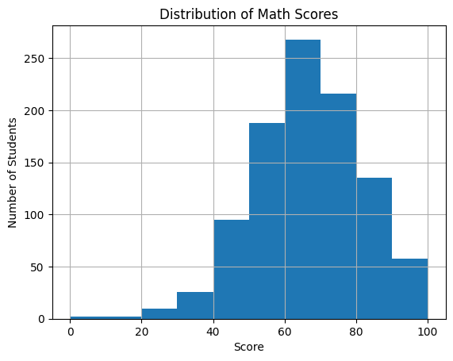
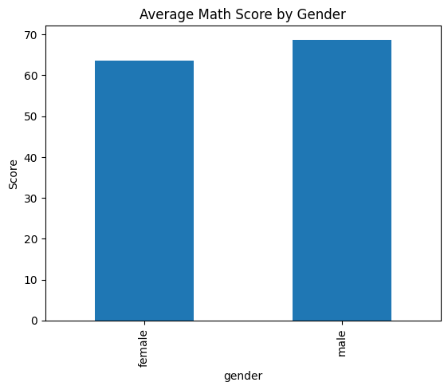
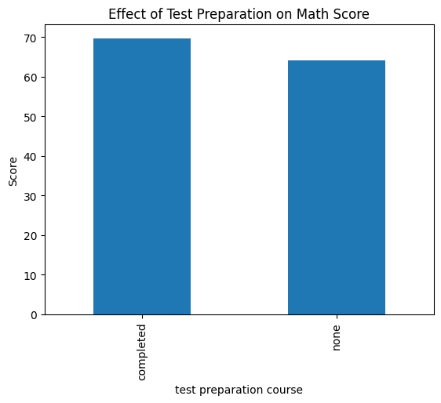
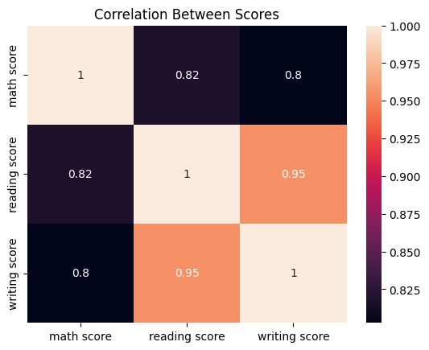

## Visualizations

### Math Score Distribution

### Gender Comparison

### Test Preparation Impact

### Correlation Heatmap
# Student Performance Analysis 📊

## Overview
A data science project analyzing factors that affect student exam scores using Python and Machine Learning.

## Dataset
- 1000 students
- 8 features including gender, parental education, lunch type, test preparation and exam scores
- Source: Kaggle (Students Performance in Exams)

## Tools Used
- Python
- Pandas (data analysis)
- Matplotlib (data visualization)
- Scikit-learn (machine learning)

## Key Findings
- Males score higher in math, females score higher in reading and writing
- Students who completed test preparation score ~6 points higher in math
- Students on standard lunch score ~11 points higher than free/reduced lunch
- Reading and writing scores are strong predictors of math performance

## Machine Learning Model
- Algorithm: Linear Regression
- Predicts math score based on reading and writing scores
- Model Accuracy (R²): 68%
- Average Prediction Error: 7.35 points

## Author
Isaac Karanja — KCA University, Data Science# student-performance-analysis
Analyzing factors affecting student exam scores using Python, data visualization and machine learning
